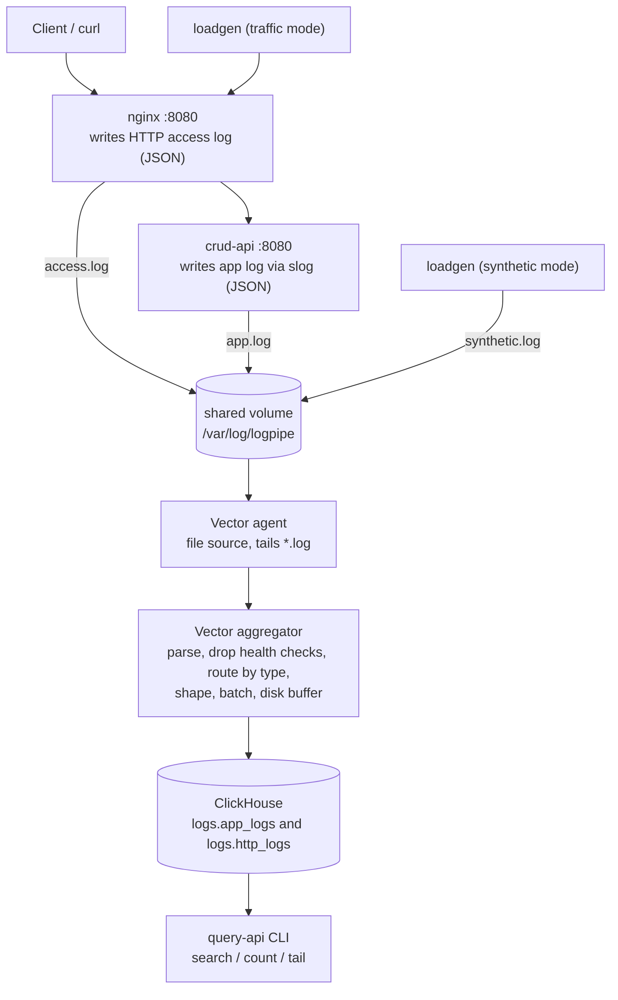

# Logpipe

Logpipe is a small Go monorepo that mimics a real logging stack: a service emits
logs, Vector ships and batches them, ClickHouse stores them, and a small CLI
reads them back. It is a learning project, built to understand how the
Vector to ClickHouse pattern actually works and why each piece is there.

The flow it models:

```
crud-api (emits logs) -> Vector agent -> Vector aggregator (batches) -> ClickHouse -> query-api
```

## What it does

- Runs a tiny REST service (`crud-api`) for a `tasks` resource that emits JSON
  application logs.
- Puts an NGINX proxy in front of it so HTTP access logs come from a real proxy,
  as a separate JSON stream.
- Ships both log files with a Vector agent, batches them in a Vector aggregator,
  and writes them into two ClickHouse tables.
- Includes a load generator (`loadgen`) and a query CLI (`query-api`).

## Architecture



Key point: the agent ships to the aggregator, never straight to ClickHouse. The
aggregator is the one place that batches inserts.

## How the plan came together

The build order was chosen to test the riskiest part first and change one thing
at a time.

1. ClickHouse first. Bring up the database and create the two target tables, so
   there is a real place for rows to land.
2. Prove the transport before the service exists. Use Vector's built in
   `demo_logs` generator and a throwaway table to confirm that agent to
   aggregator to ClickHouse works and that batches flush. This de-risks the hard
   part (transport and batching) with zero application code.
3. Build the producer. Add `crud-api` with an in-memory store, emitting two JSON
   streams, one object per line, each line tagged with a `log_type` so the
   pipeline can route it. HTTP access logs come from NGINX.
4. Wire the real logs. Swap the agent's `demo_logs` source for a `file` source
   that tails the log files, then parse, drop health-check noise, route by type,
   and shape into the real tables. Because only the source changed, any breakage
   is almost certainly parsing or schema, not the connection.
5. Load it. Add `loadgen` with a traffic mode (real HTTP requests) and a
   synthetic mode (write log lines straight to the tailed file) to push volume
   and confirm ingestion keeps up.
6. Read it back. A small `query-api` CLI with three modes: search, time-bucketed
   count, and tail.

The structure follows that order: binaries live in `cmd/`, shared code in
`internal/`, and all infra config in `deploy/`.

## Design decisions and why

### Why an aggregator that batches

This is the heart of the project.

ClickHouse stores every INSERT as a "part", which is an immutable set of files
on disk. A background process merges small parts into bigger ones over time, and
that merging is what keeps reads fast.

The catch: if you insert in tiny batches, in the worst case one row per insert,
parts are created faster than merges can combine them. ClickHouse limits how many
active parts a partition may hold (the `parts_to_throw_insert` setting, 3000 by
default). Once you cross that limit it rejects new inserts with `Too many parts`
(error code 252).

So the rule is simple: insert in large batches, not row by row. That is exactly
the aggregator's job. Agents tail the files and forward events to the aggregator,
the aggregator collects them and flushes them to ClickHouse in big batches. The
agent never writes to ClickHouse directly, so batching happens in one place.

We checked both sides of this:

- 1,000,000 synthetic rows landed as only about 6 parts, and ClickHouse stayed
  healthy.
- Forcing the bad path (one row per insert, with merges paused) produced the real
  `Too many parts` rejection. Restoring the batch fixed it. Vector retried the
  failed inserts rather than dropping them.

### Durability: a disk buffer

Vector's default buffer lives in memory. If the aggregator restarts while it is
holding events, those events are lost. We saw this happen once and dropped about
29k rows on a restart.

The fix is a disk buffer on each sink (`buffer.type: disk`) backed by a named
Docker volume mounted at the aggregator's `data_dir`. The pending queue is
written to disk, so a restart replays it instead of dropping it. `when_full:
block` applies backpressure up the pipe instead of discarding data when the
buffer fills.

### NGINX for HTTP access logs

HTTP access logs come from an NGINX proxy, not Go middleware. This is closer to a
real deployment, keeps the Go service focused on application logs, and gives two
independent JSON streams that the pipeline treats the same way.

### One JSON object per line, tagged with a type

Every log line is a single JSON object and carries a `log_type` field (`app` or
`http`). That one field lets Vector route each line to the right table without
guessing, which keeps the aggregator config simple.

### slog for application logs

The app logs use the standard library `log/slog` JSON handler, no logging
framework. Keys are renamed to match the schema (`time` becomes `timestamp`,
`msg` becomes `message`) and timestamps are forced to UTC.

### Safe queries

The query CLI never builds SQL by string concatenation. Column names come from a
per-table whitelist, and all user supplied values are passed as bound `?`
parameters through the ClickHouse driver. An unknown filter key, or a key that
does not belong to the chosen table, is rejected before any query runs.

## Project structure

```
logpipe/
  cmd/
    crud-api/    log producer (tasks REST service)
    query-api/   query CLI (search / count / tail)
    loadgen/     traffic and synthetic load generator
  internal/
    crud/        CRUD service and in-memory store
    logging/     slog JSON app log stream
    clickhouse/  ClickHouse client (query-api)
    query/       key=value syntax to parameterized SQL
    loadgen/     load generation engine
  deploy/
    clickhouse/  init SQL (creates the logs database and tables)
    vector/      agent and aggregator config
    nginx/       proxy + JSON access log format
    crud-api/    Dockerfile
    loadgen/     Dockerfile
  docker-compose.yml
  Makefile
```

## Running it

Requirements: Docker with Docker Compose, and Go 1.26+ for the host-run CLIs.

Bring the stack up:

```
make up
```

This starts ClickHouse, the Vector aggregator and agent, crud-api, and nginx.
ClickHouse runs its init SQL on first start and creates the `logs` database with
both tables.

Send some traffic so logs flow end to end:

```
make load-traffic
```

Push high volume through the synthetic path (writes straight to the tailed file):

```
make load-synthetic
```

Query the data (see the next section), then tear everything down. Add `-v` if you
also want to delete the volumes (all stored rows and logs):

```
docker compose down
docker compose down -v
```

## Query CLI

The CLI connects to ClickHouse and has three modes. Run from the host with
`go run`, or build a binary with `go build ./cmd/query-api`.

```
# most recent app log lines
go run ./cmd/query-api tail --table app --limit 20

# search app logs at WARN level in the last 30 minutes
go run ./cmd/query-api search --table app --level WARN --since 30m

# search http logs for 404s using the key=value syntax
go run ./cmd/query-api search --table http --filter "status=404" --since 1h

# count app logs per one minute bucket over the last hour
go run ./cmd/query-api count --table app --bucket 1m --since 1h
```

Common flags: `--table app|http`, `--since` (for example `10m`, `1h`),
`--limit`, `--filter "key=value key=value"`, and shortcuts `--level`,
`--service`, `--status`, `--path`. Connection settings come from the environment
(`CH_ADDR`, `CH_DB`, `CH_USER`, `CH_PASS`) and default to the local stack.

## ClickHouse schema

Two tables in the `logs` database, both partitioned by month with a 30 day TTL.

```sql
-- application logs
CREATE TABLE logs.app_logs (
    timestamp DateTime64(3),
    level     LowCardinality(String),
    service   LowCardinality(String),
    host      LowCardinality(String),
    message   String,
    fields    Map(String, String)
) ENGINE = MergeTree
ORDER BY (service, level, timestamp);

-- http access logs
CREATE TABLE logs.http_logs (
    timestamp   DateTime64(3),
    host        LowCardinality(String),
    method      LowCardinality(String),
    path        String,
    status      UInt16,
    duration_ms UInt32,
    bytes       UInt32,
    client_ip   String,
    user_agent  String
) ENGINE = MergeTree
ORDER BY (status, timestamp);
```

Extra slog attributes that do not map to a column (for example `task_id`) are
folded into the `fields` map on the app table. NGINX reports request time in
seconds, so the aggregator multiplies it by 1000 to fill `duration_ms`.

## Planned experiments

Over the next day or two I plan to run a few experiments against this stack to
see how ClickHouse behaves under different settings:

- Add skip indexes and compare query speed before and after.
- Compare daily versus monthly partitioning.
- Let the TTL expire old rows and confirm they are removed.
- Check the on-disk compression ratio.

Notes and results will be added here as I run them.

## References

These are the main sources used while building this.

- Zerodha Engineering blog, https://zerodha.tech/blog/logging-at-zerodha/ : inspiration for the file based
  JSON logging and the Vector to ClickHouse approach.
- ClickHouse MergeTree docs,
  https://clickhouse.com/docs/en/engines/table-engines/mergetree-family/mergetree
  : parts, merges, and the "too many parts" behavior.
- Vector file source,
  https://vector.dev/docs/reference/configuration/sources/file/
- Vector ClickHouse sink,
  https://vector.dev/docs/reference/configuration/sinks/clickhouse/ : batching and
  buffer settings.
- Vector Remap Language (VRL), https://vector.dev/docs/reference/vrl/ : parsing,
  routing, and shaping.
